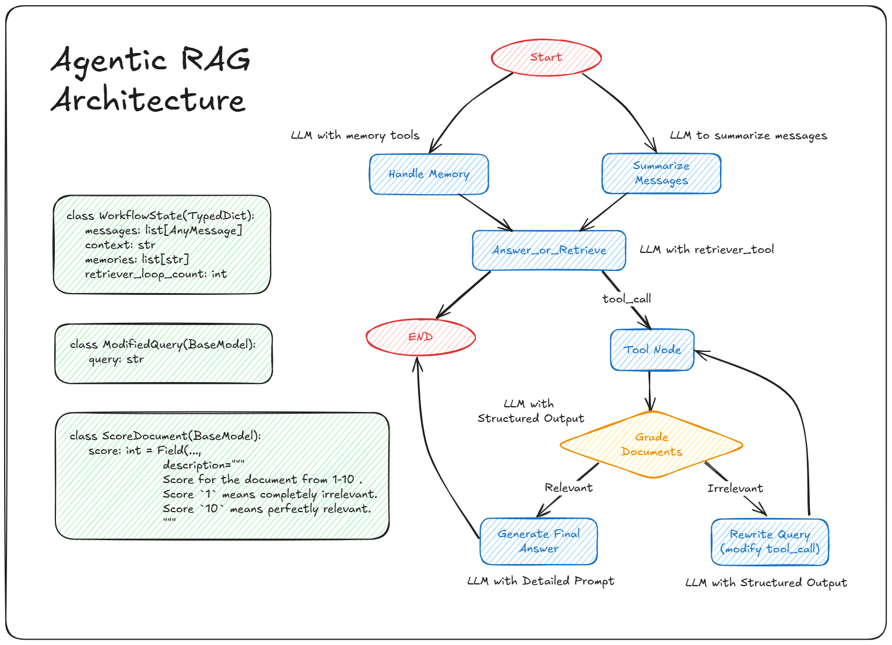
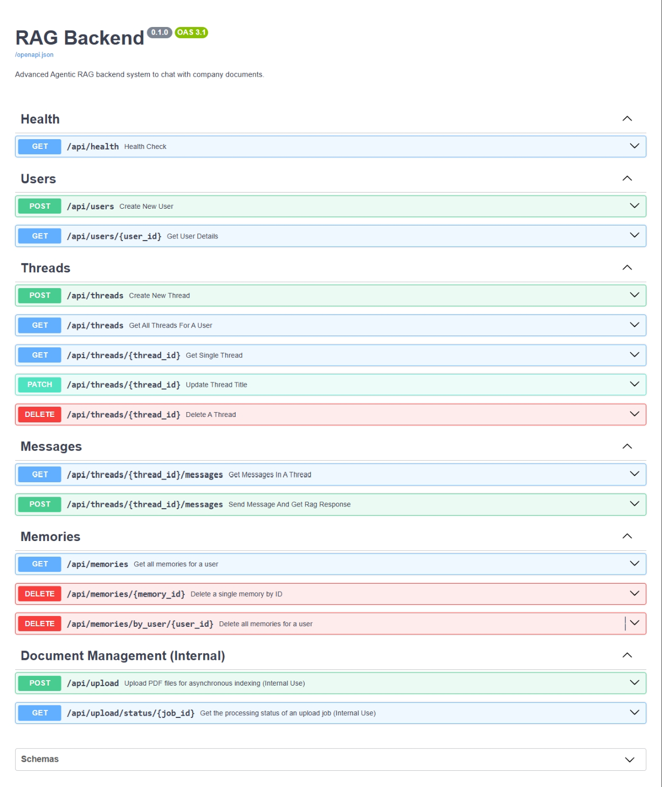
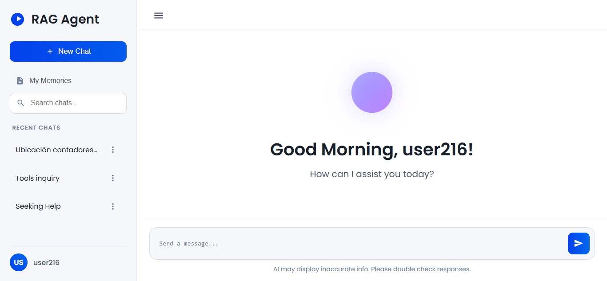

# Asistec Agentic RAG Chatbot Backend Documentation

## Table of Contents

- [Asistec Agentic RAG Chatbot Backend Documentation](#asistec-agentic-rag-chatbot-backend-documentation)
  - [Table of Contents](#table-of-contents)
  - [1. Introduction](#1-introduction)
  - [2. Project Overview](#2-project-overview)
    - [What it is](#what-it-is)
    - [Key Features](#key-features)
  - [3. Technology Stack](#3-technology-stack)
  - [4. System Architecture: The Agentic RAG Workflow](#4-system-architecture-the-agentic-rag-workflow)
  - [5. Setup and Configuration](#5-setup-and-configuration)
    - [Installation](#installation)
    - [Environment Configuration](#environment-configuration)
  - [6. Running the Backend Application](#6-running-the-backend-application)
    - [Startup Tasks](#startup-tasks)
  - [7. API Reference](#7-api-reference)
    - [Base URL](#base-url)
    - [Authentication](#authentication)
    - [Endpoints Summary](#endpoints-summary)
    - [Detailed Endpoint Descriptions](#detailed-endpoint-descriptions)
      - [Health Check](#health-check)
      - [User Management](#user-management)
      - [Chat Threads](#chat-threads)
      - [Messages](#messages)
      - [Memories](#memories)
      - [Document Management (Internal)](#document-management-internal)
  - [8. Document Upload and Indexing](#8-document-upload-and-indexing)
    - [Asynchronous Processing](#asynchronous-processing)
    - [Checking Upload Status](#checking-upload-status)
  - [9. Running the Sample Frontend](#9-running-the-sample-frontend)
    - [Prerequisites](#prerequisites)
    - [Instructions](#instructions)
    - [Configuration](#configuration)

---

## 1. Introduction

This document provides detailed information and guidance for the Asistec Agentic RAG Chatbot Backend. It covers the system's architecture, technology stack, setup instructions, API reference, and information on document indexing.

## 2. Project Overview

### What it is

The Asistec RAG Chatbot Backend is a high-performance system designed to allow users to query a collection of technical and regulatory PDF documents using natural language. Leveraging cutting-edge AI models and an agentic workflow, it retrieves relevant information from the document corpus and generates accurate, contextually relevant responses.

The system is provided as a scalable and modular API backend, intended for integration with various frontend applications (such as the provided sample frontend).

### Key Features

*   **Natural Language Querying:** Users can ask complex questions about technical documents and regulations in natural language.
*   **Retrieval-Augmented Generation (RAG):** Combines powerful language models with a dedicated knowledge base (indexed PDFs) for grounded responses.
*   **Agentic Workflow:** Implements a sophisticated process to determine if retrieval is needed, perform searches, evaluate document relevance, potentially rewrite queries for better results, and synthesize final answers.
*   **Scalable Vector Store:** Uses Pinecone for efficient semantic search over indexed document chunks.
*   **Persistent Chat History:** Stores user conversations and messages using SQLModel with a PostgreSQL (Supabase) database.
*   **Mem0 Integration:** Allows for storing and retrieving user-specific long-term memories or preferences.
*   **Asynchronous Document Indexing:** Handles the processing and indexing of large PDF files in the background via a dedicated API endpoint with status tracking.
*   **Modular API:** Designed as a RESTful API using FastAPI for easy integration.

## 3. Technology Stack

The backend is built using the following key technologies:

*   **Python:** The primary programming language.
*   **FastAPI:** A modern, fast (high-performance) web framework for building the API.
*   **SQLModel:** A library for interacting with relational databases, combining the power of SQLAlchemy with the convenience of Pydantic.
*   **PostgreSQL (Supabase):** Relational database for storing user data, chat threads, messages, and upload job statuses.
*   **Pinecone:** A managed vector database service used to store and perform similarity search on document embeddings.
*   **OpenAI API:** Provides the text embedding models.
*   **Google API:** Provides the Large Language Models (LLMs) for core RAG response generation, summarization, document grading, title generation and query rewriting.
*   **LangChain:** Framework used to build and manage interactions with LLMs, vector stores, document loading, and text splitting.
*   **LangGraph:** A framework built on LangChain for creating stateful, multi-step agentic workflows (the core of the RAG process).
*   **Mem0:** An external service used for managing user-specific long-term memories.
*   **PyPDFLoader:** A LangChain document loader for extracting text from PDF files.
*   **RecursiveCharacterTextSplitter:** A LangChain text splitter for breaking down large documents into smaller chunks suitable for embedding.
*   **Tenacity:** Library used for adding retry logic with exponential backoff to API calls (like Pinecone upserts) to handle rate limits and transient errors.
*   **Uvicorn:** An ASGI server used to run the FastAPI application.

## 4. System Architecture: The Agentic RAG Workflow



The core of the system is an agentic workflow orchestrated by LangGraph, designed to provide more intelligent and context-aware responses than a simple RAG chain.

When a user sends a message:

1.  **Receive Message:** The API receives the user's message and the current thread ID. The message is saved to the database.
2.  **Load History & Memory:** The system loads the conversation history from the database and potentially retrieves relevant long-term memories from Mem0. A summary of the conversation history might be generated if it's very long.
3.  **Agent Decision (`Answer_or_Retrieve`):** An LLM analyzes the user's query, the conversation history summary, and long-term memories. It decides whether:
    *   To answer directly (e.g., for simple greetings or general knowledge questions).
    *   To use a `retriever_tool` to search the document knowledge base for relevant information (for specific questions about regulations or indexed content).
4.  **Tool Execution (`retriever_tool`):** If the LLM decides to use the tool, the `retriever_tool` executes. It takes a search query (formulated by the LLM), performs a vector similarity search in Pinecone, retrieves the top N most similar document chunks, and returns their combined content.
5.  **Document Grading:** Another LLM grades the retrieved document content based on its relevance to the original user query (using a score from 0-10).
6.  **Query Rewrite (Conditional):**
    *   If the documents are deemed **relevant** (score >= 6), the process proceeds to generate the final answer.
    *   If the documents are deemed **less relevant** (score < 6) AND the system hasn't retried too many times (loop count < max), the workflow routes to a query rewriting step. An LLM analyzes the original query and history to generate a new, optimized search query. The process then loops back to the `Tool Execution` step with the new query (limited to a maximum of 2 attempts to prevent infinite loops).
7.  **Prepare Final Context:** After the retrieval/grading/rewrite loop (either because documents were relevant or max retries were reached), the retrieved document content (even if low-scoring) is formatted as the final context for the answer generation step.
8.  **Generate Final Answer:** A powerful LLM receives the full conversation history, the selected retrieved context, and the user's latest query. Using a detailed prompt, it synthesizes the information to provide a comprehensive, accurate, and contextually relevant answer, adhering to the role of the expert AI assistant for Asistec.
9.  **Save Assistant Response:** The generated AI response is saved to the database as a new message in the thread.
10. **API Response:** The final AI message content is returned to the client.

This workflow ensures that the AI intelligently leverages the document base when needed, attempts to improve searches if initial results are poor, and uses conversation history and potentially user memory for better context.

## 5. Setup and Configuration

To get the backend running, you need to set up the environment, install dependencies, and configure external services.


### Installation

1.  **Clone the Repository:** Obtain the project code.
2.  **Navigate to Project Directory:** Open your terminal and change directory to the project root (`RAG_Chatbot`).
3.  **Create Virtual Environment (using `uv`):**
    ```bash
    uv venv
    # On Windows: .\venv\Scripts\activate
    source venv/bin/activate
    ```
4.  **Install Dependencies:** The project uses `pyproject.toml` and potentially `uv.lock` or equivalent for dependency management. If using `uv` (recommended):
    ```bash
    uv sync
    ```
    If using `pip` with `requirements.txt` (which you would generate from `pyproject.toml`):
    ```bash
    pip install -r requirements.txt
    ```

### Environment Configuration

Create a file named `.env` in the root directory (`RAG_Chatbot/.env`). Copy the contents of `.env.example` and fill in your credentials and desired settings.

## 6. Running the Backend Application

Once configured, run the application using Uvicorn:

```bash
uvicorn main:app --reload --host 0.0.0.0 --port 8000
```

*   `main:app`: Refers to the `app` object in `main.py`.
*   `--reload`: Useful for development; the server restarts automatically on code changes. Remove this flag for production.
*   `--host 0.0.0.0`: Makes the server accessible externally (use `127.0.0.1` or `localhost` for local-only access).
*   `--port 8000`: Specifies the port to run on.

The API will be accessible at `http://127.0.0.1:8000` (or your server's IP/hostname).

### Startup Tasks

When the application starts (via the `lifespan` function in `main.py`), it automatically performs the following tasks:

- **Database Table Creation:** Checks if tables defined in `database/models.py` (`users`, `threads`, `messages`, `upload_jobs`, `file_processing_attempts`) exist and creates them if they don't.

Monitor the console output during startup for messages regarding these tasks.

## 7. API Reference

The API provides endpoints for managing chat threads, sending messages, handling document uploads, and accessing user memories.

### Base URL

All endpoints are prefixed with `/api`.
Example: `http://127.0.0.1:8000/api`

### Authentication

**Note:** As per current implementation, there is **no robust authentication** mechanism in place. The system relies on `user_id` provided in request payloads/query parameters to identify users and authorize thread/memory access. User IDs in the provided OpenAPI schema are specified as `string`, aligning with how they might be represented in external systems, though the current DB model uses `int` for `User.id`. This potential mismatch needs to be addressed during integration.

**For production deployment, it is critical to implement a proper authentication and authorization layer** (e.g., using API keys, OAuth2, JWT tokens) to verify user identity and control access to data.

### Endpoints Summary

Below is a summary of the API endpoints based on the provided OpenAPI schema:

| Method | Path                                       | Description                                                     | Request Body (Schema)                     | Response Body (Schema)                      | Tags                                    |
| :----- | :----------------------------------------- | :-------------------------------------------------------------- | :---------------------------------------- | :------------------------------------------ | :-------------------------------------- |
| `GET`  | `/health`                                  | Health Check                                                    | -                                         | `{}`                                        | `Health`                                |
| `POST` | `/users`                                   | Create New User                                                 | `UserCreateRequestSchema`                 | `UserResponseSchema`                        | `Users`                                 |
| `GET`  | `/users/{user_id}`                         | Get User Details                                                | -                                         | `UserResponseSchema`                        | `Users`                                 |
| `POST` | `/threads`                                 | Create New Thread                                               | `ThreadCreateWithUserSchema`              | `ThreadResponseSchema`                      | `Threads`                               |
| `GET`  | `/threads`                                 | Get All Threads For A User                                      | Query: `user_id` (string)                 | `List[ThreadResponseSchema]`                | `Threads`                               |
| `GET`  | `/threads/{thread_id}`                     | Get Single Thread                                               | -                                         | `ThreadResponseSchema`                      | `Threads`                               |
| `PATCH`| `/threads/{thread_id}`                     | Update Thread Title                                             | `ThreadUpdateRequestSchema`               | `ThreadResponseSchema`                      | `Threads`                               |
| `DELETE`| `/threads/{thread_id}`                    | Delete A Thread                                                 | -                                         | `204 No Content`                            | `Threads`                               |
| `GET`  | `/threads/{thread_id}/messages`            | Get Messages In A Thread                                        | -                                         | `List[MessageResponseSchema]`               | `Messages`                              |
| `POST` | `/threads/{thread_id}/messages`            | Send Message And Get Rag Response                               | `MessageCreateWithUserSchema`             | `ChatResponseSchema`                        | `Messages`                              |
| `GET`  | `/memories`                                | Get all memories for a user                                     | Query: `user_id` (string)                 | `GetAllMemoriesResponse`                    | `Memories`                              |
| `DELETE`| `/memories/{memory_id}`                   | Delete a single memory by ID                                    | -                                         | `DeleteMemoryResponse`                      | `Memories`                              |
| `DELETE`| `/memories/by_user/{user_id}`             | Delete all memories for a user                                  | -                                         | `DeleteAllUserMemoriesResponse`             | `Memories`                              |
| `POST` | `/upload`                                  | Upload PDF files for asynchronous indexing (Internal Use)       | `multipart/form-data` (files[])           | `UploadFileResponse`                        | `Document Management (Internal)`        |
| `GET`  | `/upload/status/{job_id}`                  | Get the processing status of an upload job (Internal Use)       | -                                         | `JobStatusResponse`                         | `Document Management (Internal)`        |

### Detailed Endpoint Descriptions

API documentation (Swagger UI) is automatically generated by FastAPI and available at `/docs` (e.g., `http://127.0.0.1:8000/docs`). You can use this interface to explore schemas and test endpoints interactively. The schemas referenced above (`UserCreateRequestSchema`, `ThreadResponseSchema`, etc.) are fully defined in the `/docs` interface under the "Schemas" section.



#### Health Check

*   **`GET /health`**: Simple endpoint to verify the service is running.
  
#### User Management

*   **`POST /users`**: Endpoint to explicitly create a new user record. Expects `UserCreateRequestSchema` which includes `user_id` (string) and optionally `email`.
*   **`GET /users/{user_id}`**: Retrieve details for a specific user by their string `user_id`.

#### Chat Threads

*   **`POST /threads`**: Creates a new chat thread. Expects `ThreadCreateWithUserSchema` including `user_id` (string) and optional `title`.
*   **`GET /threads`**: Lists threads for a user, filtered by `user_id` passed as a query parameter.
*   **`GET /threads/{thread_id}`**: Retrieves details for a single thread by its `thread_id`.
*   **`PATCH /threads/{thread_id}`**: Updates a thread's title. Expects `ThreadUpdateRequestSchema` in the request body.
*   **`DELETE /threads/{thread_id}`**: Deletes a thread and associated messages.

#### Messages

*   **`GET /threads/{thread_id}/messages`**: Retrieves all messages within a specific thread.
*   **`POST /threads/{thread_id}/messages`**: The primary endpoint for sending a user message and triggering the RAG workflow. Expects `MessageCreateWithUserSchema` including the `content` of the message and the `user_id`. Returns `ChatResponseSchema` containing the assistant's response and IDs.

#### Memories

*   **`GET /memories`**: Retrieves memories from Mem0 for a user identified by `user_id` query parameter.
*   **`DELETE /memories/{memory_id}`**: Deletes a specific memory in Mem0 by its ID.
*   **`DELETE /memories/by_user/{user_id}`**: Deletes all memories for a user in Mem0.

#### Document Management (Internal)

*   **`POST /upload`**: **(Internal Use Only)** Upload PDF files. Processes files asynchronously for indexing. Does not accept tags. Returns a `job_id`.
*   **`GET /upload/status/{job_id}`**: **(Internal Use Only)** Check the status of an upload job.


## 8. Document Upload and Indexing

The process of taking raw PDF files and making them searchable in the RAG system is handled by the `/upload` endpoint.

### Asynchronous Processing

Given that PDF files, especially large ones (300-600 pages) in languages like Spanish, can take significant time to process (load, chunk, embed) and indexing them into Pinecone involves external API calls with rate limits, the `/upload` endpoint uses asynchronous background tasks:

1.  You send one or more PDF files via a `multipart/form-data` POST request to `/api/upload`.
2.  The backend immediately reads the file bytes and creates a new `UploadJob` record in the database with a unique `job_id`. Records for each file within the job are also created with a status of `pending`.
3.  The endpoint returns a `202 Accepted` response instantly, including the `job_id`.
4.  For each accepted file, a separate background task is initiated by FastAPI.
5.  Each background task processes one file:
    *   It updates the file's status in the database to `processing`.
    *   It loads the PDF content (`core/loader.py`).
    *   It splits the content into chunks (`core/splitter.py`).
    *   It adds these chunks (generating embeddings) to the Pinecone index (`core/vectorstore.py`). This step includes internal batching and retry logic using `tenacity` to handle Pinecone/OpenAI rate limits.
    *   Once complete, it updates the file's status in the database to `completed` or `failed`, along with a message and potentially the number of chunks indexed.
    *   The overall job status is updated based on the status of its files.

This design prevents the API request from timing out and allows the client to initiate indexing for many files without waiting for completion.

### Checking Upload Status

To know when a file has been indexed, you must use the status endpoint:

1.  Call `POST /api/upload` and note the `job_id` in the response.
2.  Periodically call `GET /api/upload/status/{job_id}` (e.g., every 5-10 seconds).
3.  The response from the status endpoint will show the `overall_status` of the job and the status (`pending`, `processing`, `completed`, `failed`) for each individual file within that job, including any error messages or chunk counts.
4.  Once a file's status is `completed`, it means its content is now available for querying via the chat endpoints.

## 9. Running the Sample Frontend

A simple sample frontend is provided in the `frontend` folder. This frontend is basic and serves primarily to demonstrate interacting with the backend API.

### Prerequisites

*   A web browser.
*   The backend must be running and accessible from where you open the frontend (e.g., on `http://127.0.0.1:8000`).

### Instructions

1.  Navigate to the `frontend` folder in your file explorer.
2.  Open the `index.html` file in your web browser.



### Configuration

The sample frontend is a simple HTML/CSS/JS application. It likely contains JavaScript code that makes API calls to the backend. You might need to:

1.  **Check the API Base URL:** Open `frontend/index.html` in a text editor. Locate where the API base URL is defined (e.g., `http://127.0.0.1:8000/api`) and ensure it matches the actual address where your backend is running. Note the API base path is `/api` according to the schema.
2.  **CORS:** Ensure the backend is configured to allow requests from the origin where you are opening `index.html`. By default, the backend is configured with `allow_origins=["*"]` which permits access from any origin, suitable for local testing. For production, restrict `allow_origins` to your frontend's actual domain. You can add allowed origins in `core/config.py`.

Interact with the frontend to send messages and observe the responses from the backend.
